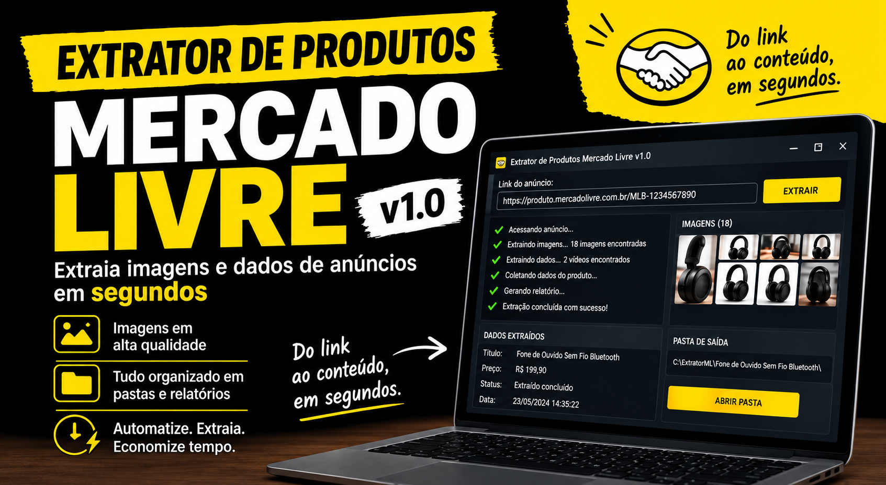

# 🚀 Mercado Livre Product Extractor v1.0

### Automating authorized e-commerce catalog workflows with Python

> A Python-based automation solution designed to transform official and authorized Mercado Livre product links into structured product information and organized media assets.

🔒 **Portfolio Project:** The source code and executable application are not publicly available.

---

## 🎥 Project Demo

Watch the complete demonstration of the project on LinkedIn:

[](https://lnkd.in/p/daD3n9Cf)

---

## 💡 Project Overview

E-commerce teams often deal with repetitive catalog operations such as locating product information, saving images, identifying available media, organizing files, and reviewing the final result.

I built **Mercado Livre Product Extractor v1.0** to explore how this workflow could be transformed into a faster and more structured automated process.

The core concept is simple:

**Official Product Link → Automation → Data & Media Processing → Organized Catalog → Sales Team**

The application was specifically designed to work with **Mercado Livre product links**.

---

## 🎯 The Problem

For small e-commerce operations, repetitive catalog preparation can consume valuable time.

A typical manual workflow may involve:

* Finding the product title;
* Checking the current price;
* Saving product images;
* Identifying available media;
* Organizing files;
* Reviewing the extracted information;
* Repeating the process for multiple products.

Each individual task may be simple, but repeating the entire workflow across multiple products creates unnecessary operational overhead.

The goal of this project was to automate this repetitive process.

---

## 💡 The Solution

The application receives an **official and authorized product URL** and automates the processing of the information and media made available through the product page.

Depending on the product, the workflow can process:

* 🏷️ Product title;
* 💰 Product price;
* 🖼️ Available product images;
* 🎥 Product videos, when available and authorized for use;
* 📁 Organized product folders;
* 📋 Extraction process reports.

The interface was intentionally designed to keep the workflow simple:

**Paste the link → Start the process → Receive an organized result**

---

## 🔄 Workflow

```text
┌─────────────────────────┐
│ Official Product URL    │
└────────────┬────────────┘
             │
             ▼
┌─────────────────────────┐
│ Browser Automation      │
│ Playwright + Chromium   │
└────────────┬────────────┘
             │
             ▼
┌─────────────────────────┐
│ Data & Media Processing │
└────────────┬────────────┘
             │
             ▼
┌─────────────────────────┐
│ File Organization       │
└────────────┬────────────┘
             │
             ▼
┌─────────────────────────┐
│ Structured Product      │
│ Catalog                 │
└─────────────────────────┘
```

The objective is to turn a multi-step manual workflow into a single streamlined process.

---

## 🛠️ Technology Stack

| Technology        | Role in the project                            |
| ----------------- | ---------------------------------------------- |
| 🐍 **Python**     | Core application logic and automation workflow |
| 🎭 **Playwright** | Browser automation and web interaction         |
| 🌐 **Chromium**   | Browser environment controlled by Playwright   |
| 🎬 **FFmpeg**     | Video and media processing                     |
| 🖥️ **GUI**       | User-facing graphical interface                |

### Why these technologies?

The project required a combination of browser automation, data processing, file management, media processing, and user interaction.

Python provided the foundation for coordinating these components, while Playwright and Chromium handled browser automation. FFmpeg was integrated for video-related processing, and the graphical interface was designed to make the workflow accessible to non-technical users.

---

## 🖥️ User Experience

One of the design goals was to minimize the technical knowledge required to operate the application.

Instead of requiring users to interact directly with command-line tools, the workflow was designed around a graphical interface.

### Basic interaction

```text
1. Open the application
        ↓
2. Paste an authorized product URL
        ↓
3. Start the process
        ↓
4. Wait for the automation
        ↓
5. Access the organized output
```

This approach focuses on making technical automation useful to people who may not have a programming background.

---

## 📂 Output Structure

The generated materials are organized by product to simplify their subsequent use.

A conceptual representation of the output is:

```text
Product/
├── information/
├── images/
├── videos/
└── report/
```

The final structure may vary depending on the information and media available for each product.

---

## 📊 From Manual Work to Automation

### Before

```text
Find information
      ↓
Copy data
      ↓
Save images
      ↓
Identify media
      ↓
Organize files
      ↓
Review information
      ↓
Repeat
```

### With the automation

```text
Authorized URL
      ↓
Automated workflow
      ↓
Organized output
```

The project explores how repetitive operational work can be converted into a streamlined software workflow.

---

## 🧠 Engineering Perspective

The main value of this project goes beyond implementing individual features.

The development process followed a practical problem-solving approach:

**Operational need → Problem analysis → Solution design → Implementation → Automation → User experience**

This project allowed me to work with concepts such as:

* Web browser automation;
* Process automation;
* Python application development;
* Data extraction and processing;
* File system organization;
* Media processing;
* Graphical user interfaces;
* Workflow design;
* Error handling and process feedback;
* Translating an operational problem into a software solution.

---

## 📚 What I Learned

Building this project reinforced an important aspect of software development:

> **Good software starts with understanding the problem, not with choosing a programming language.**

Throughout the development process, I worked on connecting different technologies into a single workflow and considered not only how the automation would work technically, but also how a non-technical user would interact with it.

The project helped me develop a better understanding of:

* Designing automation workflows;
* Integrating multiple technologies;
* Automating browser-based processes;
* Handling files and media;
* Building user-oriented interfaces;
* Thinking about real-world operational requirements;
* Considering responsible use of automated systems.

---

## 🔐 Responsible & Authorized Use

This project was designed around the use of **official product links and authorized product information and media**.

It is **not intended to**:

* Copy competitors' listings;
* Bypass platform security mechanisms;
* Circumvent access controls;
* Reuse protected content without authorization.

The intended use case is for **resellers, affiliates, suppliers, and commercial partners who have the appropriate authorization to use the relevant product information and promotional materials**.

> Users are responsible for ensuring that their use of the application complies with applicable permissions, intellectual property rights, platform rules, and other relevant requirements.

---

## 🚧 Roadmap

### v1.0 — Current

* [x] Graphical user interface
* [x] Mercado Livre product URL input
* [x] Browser automation
* [x] Product information processing
* [x] Image processing
* [x] Video processing
* [x] Organized file output
* [x] Process reporting

### Future Improvements

* [ ] Improved user interface
* [ ] More robust error handling
* [ ] More detailed process feedback
* [ ] Enhanced reporting
* [ ] Additional catalog organization options
* [ ] Expanded technical documentation

---

## 🔒 Source Code

The source code and executable application are intentionally **not publicly distributed**.

This repository serves as a **technical portfolio and project case study**, documenting the project's purpose, architecture, technology stack, workflow, and development process without providing the application for public download or reuse.

---

## 👨‍💻 About Me

### Gabriel Henrique

**Developer in training | Python | Automation | Software Development**

I am interested in building practical software solutions that transform repetitive processes into efficient and accessible workflows.

My current focus includes:

* 🐍 Python
* ⚙️ Automation
* 🌐 Web Development
* 💻 Software Development
* 🌐 Computer Networks
* 🧩 Problem Solving

This project represents part of my journey toward becoming a software developer and building solutions for real-world problems.

---

## 📌 Project Information

|                      |                                 |
| -------------------- | ------------------------------- |
| **Project**          | Mercado Livre Product Extractor |
| **Version**          | v1.0                            |
| **Category**         | Automation / E-commerce         |
| **Primary Language** | Python                          |
| **Status**           | Portfolio Project               |
| **Source Code**      | Private                         |
| **Platform**         | Mercado Livre                   |

---

### ⭐ Thanks for taking a look

If you are a recruiter, developer, entrepreneur, or someone interested in automation and software development, I hope this project provides a useful look into how I approach real-world problems and turn them into practical software solutions.
